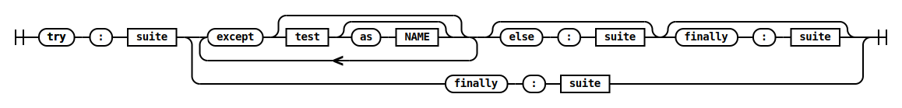
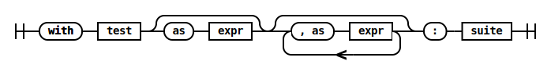

Python grammar railroad diagrams
================================

Requirements:
 - `cairo`, e.g. `brew install cairo`

Run:
```console
$ python main.py
```





Credit
------

railroad.py is adapted from https://github.com/tabatkins/railroad-diagrams.git